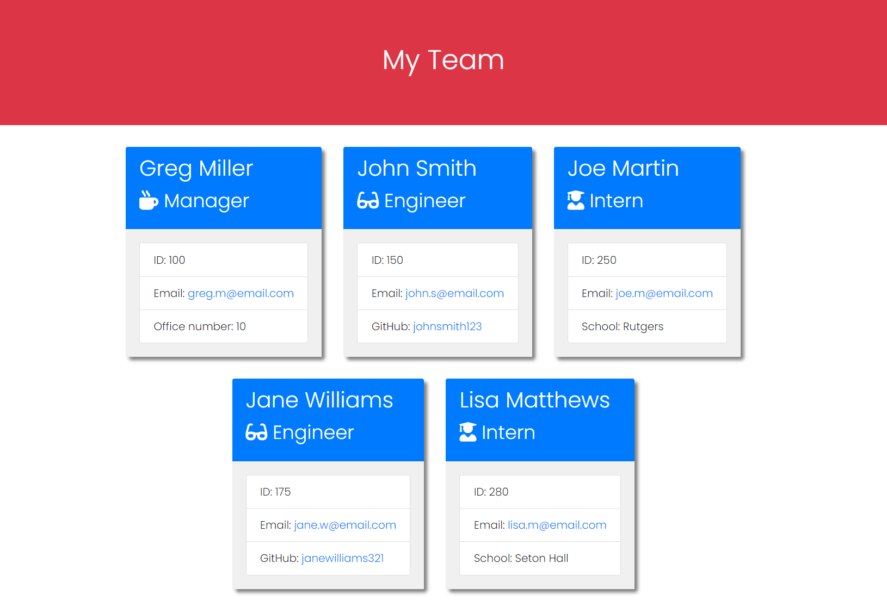

# Team Profile Generator

## Table-of-Contents

- [Description](#description)
- [Installation](#installation)
- [Usage](#usage)
- [Contributing](#contributing)
- [Tests](#tests)
- [License](#license)
- [Questions](#questions)

## [Description](#table-of-contents)

This application allows users to generate a team profile utilizing node modules, which will generate an index.html file based on their input.

## [Installation](#table-of-contents)

A user must clone this repository and make sure they have installed Node.js on their computer. Once cloned and installed, the user will be required to install inquirer and jest modules by typing `npm install` in their terminal.

## [Usage](#table-of-contents)

From the command line in the terminal, a user can type `node index` to begin a series of questions in order to generate a team profile based on the employee information that is given.

Click on the following link to view the video demonstration:
https://drive.google.com/file/d/1tERZUKHo-TTacpp8uqIqZXFY2q_gCjZk/view

### **Screenshot of Generated Team Profile:**

## [Contributing](#table-of-contents)

Contributors can see installation instructions or contact me with the information below.

## [Tests](#table-of-contents)

Run `npm test` to run tests utilizing jest.

## [License](#table-of-contents)

## [Questions](#table-of-contents)

If you have any questions about this project, please contact me using the following links:

[GitHub](https://github.com/Gregm316)

[Email: gregm316@gmail.com](mailto:gregm316@gmail.com)
